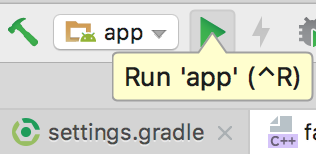

# Pastelería Mil Sabores - Proyecto Aplicaciones Móviles.

* Asignatura: Desarrollo de Aplicaciones Móviles.
* Sección: DSY1105-002D
* Profesor: Ronald Villalobos.
* Integrantes: Federico Pereira - Sebastián Robles - Carlos Miranda - Anyara Rosso.

---

## Alcance del Proyecto:

Este proyecto consiste en el desarrollo de una aplicación móvil de e-commerce para la "Pastelería Mil Sabores", una empresa con 50 años de trayectoria.
Nuestro objetivo es modernizar su sistema de ventas online, ofreciendo una experiencia de compra accesible, intuitiva y que refleje la calidad y tradición de la marca.

---

## Pasos para instalación y ejecución:

1. Clona el repositorio

Abre tu terminal y ejecuta el siguiente comando:
```
git clone https://github.com/catluvies/dsy1105-pasteleria-mil-sabores.git
```
2. Abre el proyecto en Android Studio:

En la pantalla de bienvenida de Android Studio, selecciona "Open".
Busca la carpeta del proyecto que acabas de clonar y ábrela.

3. Sincroniza las dependencias:

Espera a que Android Studio descargue automáticamente todas las librerías necesarias.
Este proceso se llama "Gradle Sync" y puede tardar unos minutos la primera vez.

4. Ejecuta la aplicación

Selecciona un emulador o un dispositivo físico.
Presiona el botón de 'Run' (el ícono de triángulo verde) en la barra superior.



---

## Funcionalidades a Desarrollar:


* Registro y Login: Para implementar formularios con validación de datos.
* Catálogo de Productos: La pantalla principal para mostrar la interfaz y la navegación.
* Carrito de Compras: Para manejar el guardado de datos en el dispositivo. 
* Crear una vista para el administrador.
* Administrar productos del catalogo mediante perfil de admin.
* Recursos nativos: Galería y Cámara para subir productos como administrador.

---

## Hitos
* Se logró hacer el commit inicial

---

## Stack Tecnológico:

*   [![Kotlin][Kotlin-shield]][Kotlin-url]
*   [![Jetpack Compose][Compose-shield]][Compose-url]
*   [![Navigation Compose][Navigation-Compose-shield]][Navigation-Compose-url]
*   [![StateFlow][StateFlow-shield]][StateFlow-url]
*   [![Android Studio][Android-Studio-shield]][Android-Studio-url]
*   [![MVVM][MVVM-shield]][MVVM-url]
*   [![Room][Room-shield]][Room-url]
*   [![Material Design 3][Material-3-shield]][Material-3-url]

---

## Guía de Estilo Visual:

#### Colores:

* Color de Fondo: Crema Pastel (`#FFF5E1`)
* Para Botones y Elementos Interactivos: Rosa Suave (`#FFC0CB`) y Chocolate (`#8B4513`)
* Para Textos: Marrón Oscuro (`#5D4037`) y Gris Claro (`#B0BEC5`)

#### Tipografía:

* Títulos y Encabezados: Pacifico.
* Textos generales: Lato.

--- 

<!-- Shields & URLS -->
[Kotlin-shield]: https://img.shields.io/badge/Kotlin-7F52FF?style=for-the-badge&logo=kotlin&logoColor=white
[Kotlin-url]: https://kotlinlang.org/
[Compose-shield]: https://img.shields.io/badge/Jetpack%20Compose-4285F4?style=for-the-badge&logo=jetpackcompose&logoColor=white
[Compose-url]: https://developer.android.com/jetpack/compose
[Navigation-Compose-shield]: https://img.shields.io/badge/Navigation%20Compose-073042?style=for-the-badge&logo=jetpackcompose&logoColor=white
[Navigation-Compose-url]: https://developer.android.com/jetpack/compose/navigation
[StateFlow-shield]: https://img.shields.io/badge/StateFlow-2E8B57?style=for-the-badge&logo=kotlin&logoColor=white
[StateFlow-url]: https://developer.android.com/kotlin/flow/stateflow-and-sharedflow
[Android-Studio-shield]: https://img.shields.io/badge/Android%20Studio-3DDC84?style=for-the-badge&logo=androidstudio&logoColor=white
[Android-Studio-url]: https://developer.android.com/studio
[MVVM-shield]: https://img.shields.io/badge/Arquitectura-MVVM-orange?style=for-the-badge
[MVVM-url]: https://developer.android.com/jetpack/guide
[Room-shield]: https://img.shields.io/badge/Room-DB-A4C639?style=for-the-badge&logo=sqlite&logoColor=white
[Room-url]: https://developer.android.com/jetpack/androidx/releases/room
[Material-3-shield]: https://img.shields.io/badge/Material%20Design%203-757575?style=for-the-badge&logo=materialdesign&logoColor=white
[Material-3-url]: https://m3.material.io/